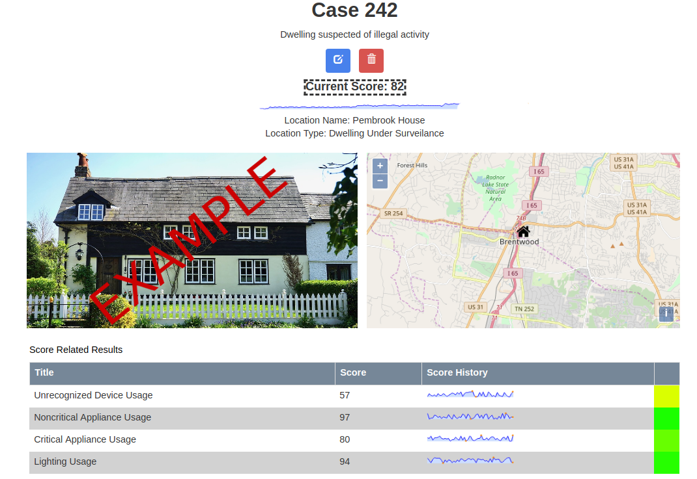
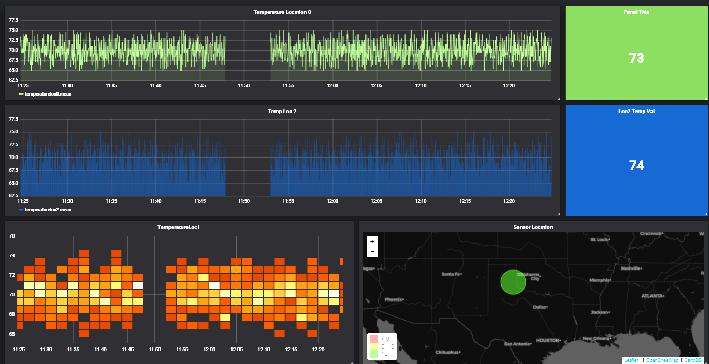

# Overview

ShareAL provides a flexible platform for interacting with streaming data from IoT sensors and smart meters. Its intended area of
application is in the realm of Non-intrusive load monitoring (NILM) in the energy sector. However, it can be used in any domain
to do the following:

- Characterize facilities via NILM through the scoring of analytic products
- Ask interesting questions of streaming data using data visualization tools and custom analytics
- Run analytics in local HPC environment with minimal configuration and map results back to the web interface 

## Preparation

* copy project folder onto Linux machine
* if using docker slurm cluster, verify Linux distro utilizes systemd. Otherwise, systemd is unnecessary
* make sure ports 3000 (web app), 3100 (grafana), 27017 (mongo) and 5000 (slurm web server) are open
* install [docker](https://docs.docker.com/install/) and [docker-compose](https://docs.docker.com/compose/install/)

## Launch

* for initial launch, run deploy.sh
* subsequently, use start.sh / stop.sh to start / stop the containers
* for web app, go to localhost:3000
* Enjoy

## Documentation and Developer Guide

* Please see documentation folder
* Can be viewed in browser using [mkdocs](https://www.mkdocs.org/)
* CD into documentation folder and run 'mkdocs serve', then go to localhost:8000

## Components

The figure below shows a diagram of how the various components of ShareAL are integrated. A brief description of each component follows. 

#### WebApp

The web application, shown below, is the main interface for ShareAL users and utilizes the MEANJS framework. In addition to normal website functionality such as user management, it gives the user access to dashboards, data sets, analytics and the ability to perform analyses on the HPC cluster. The dashboard is geared towards facility characterization and allows the user to create a metric composed of multiple analytics for a particular site to provide a cumulative score. Data sets and analytics can be shared amongst users to allow collaboration or access to the data can be restricted. Once analytics and data sets have been uploaded to the website, an analysis can then be run on the HPC cluster and the results applied to a particular dashboard's facility characterization score or viewed on the results page. 

Below is a fictitious dashboard example for a site under surveillance. It provides both the historical and current scores of each analytic that contributes to the total score as well as for the total score itself, in this case the score being related to potential illegal activity. Each of the analytics is related to energy usage of a particular category of devices and the total score is a combination of those individual metrics. 

#### Streaming Dashboard

The streaming dashboard, shown below, allows the user to visualize data in real time. It can be accessed via the WebApp or at an alternate url. It is composed of two open source projects - Grafana and InfluxDB. Grafana is a tool for time series analytics that allows dashboards to be created using drag-and-drop capabilities via a web interface. With Grafana, updating data sources, layouts or transformations for graphs is intuitive and additional functionality can be integrated using a wide array of plugins. InfluxDB is a time series database designed for monitoring and analytics that integrates well with Grafana and has APIs in many languages commonly used for ingesting streaming data.  

#### HPC Cluster

The HPC cluster is a collection of docker containers, one acting as the master node and the other as the slave nodes. It is quick to deploy and ideal for evaluating the ShareAL platform. In practice, users may choose to integrate the platform with their existing HPC slurm environments. Instructions for doing so are provided in the documentation. 

## Background

In Nonintrusive Load Monitoring (NILM) a Nonintrusive Appliance Load Monitor (NALM) can monitor power usage of multiple devices on a single circuit without having to be directly connected to each device. The NALM performs an analysis of the current and voltage waveforms of the total load and garners from this information the type of loads drawing power and how much each load is drawing. Previous work has investigated using NILM to enhance electricity audits of commercial buildings and to understand domestic energy consumption. 

Law enforcement has used raw energy usage to identify clandestine methamphetamine laboratories for some time. NILM offers a way of analyzing energy usage in a more refined manner by both identifying what types of devices are being run and understanding how much energy each device consumes using NALMs. These energy signatures could then be used to identify whether a building is strictly residential or whether it is being used for other purposes. And all of this analysis could be achieved with minimal intrusion. But what is needed is a way of amalgamating the NILM data, generating custom analytics and scoring individual facilities. 

ShareAL provides a lightweight extensible platform for data analytics that meets the need of NILM facility characterization. It consists of three core components: a full stack web application based on the MEANJS project, a grafana dashboard for analyzing streaming data and a High Performance Computing (HPC) cluster running slurm for performing real time analysis. ShareAL allows users to create dashboards for each facility of interest, score them via custom analytic products and to share the results of analyses performed on local HPC slurm clusters. The entire framework is Dockerized for ease of deployment and can be launched via a single script once dependencies are installed. 

